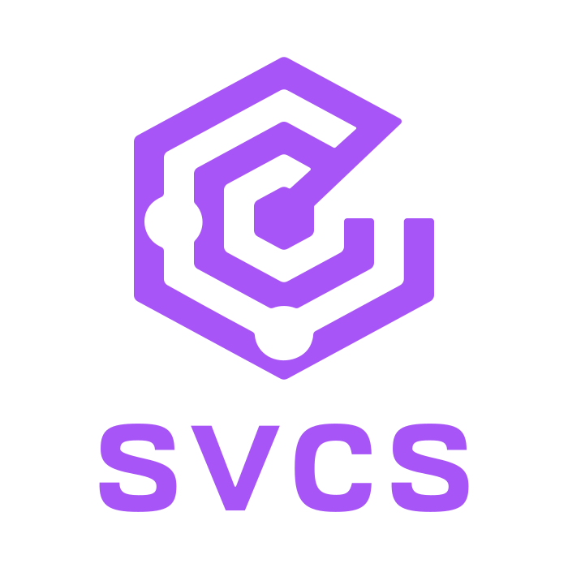
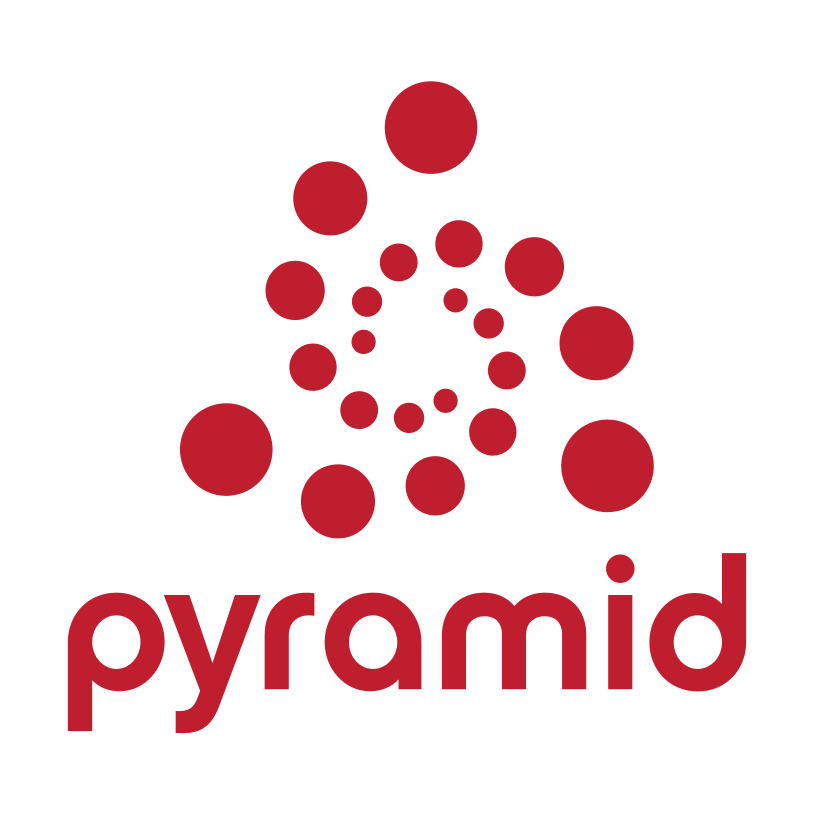

<!-- begin logo -->
<p align="center">
  <a href="https://github.com/hynek/svcs-pyramid/">
    
  </a>
  <a href="https://trypyramid.com">
    
  </a>
</p>

<p align="center">
  <em>svcs Integration for Pyramid.</em>
</p>

<!-- end logo -->

<p align="center">
  <a href="https://svcs-pyramid.hynek.me"></a>
  <a href="https://github.com/hynek/svcs-pyramid/blob/main/.github/AI_POLICY.md"></a>
  <a href="https://pypi.org/project/svcs-pyramid/"></a>
</p>

---

<!-- begin pypi -->
<!-- begin index -->

*svcs-pyramid* is the [*svcs*](https://svcs.hynek.me/) integration for [Pyramid](https://trypyramid.com).

*svcs* (pronounced *services*) is a **dependency container** for Python.
It gives you a central place to register factories for types/interfaces and then imperatively acquire instances of those types with **automatic cleanup** and **health checks**.

*svcs-pyramid* wires that up for Pyramid: it stores the *svcs* registry in Pyramid's own registry (yes, unfortunate name clash) and uses a [tween](https://docs.pylonsproject.org/projects/pyramid/en/main/glossary.html#term-tween) to attach a fresh container to every request – and to close it when the request is done.

<!-- end index -->

<!-- skip: next -->

```python
import svcs_pyramid


def make_app():
    with Configurator(settings=settings) as config:
        svcs_pyramid.init(config)
        svcs_pyramid.register_factory(config, Database, db_factory)

        return config.make_wsgi_app()


@view_config(route_name="index")
def view(request):
    db, api, cache = svcs_pyramid.get(request, Database, WebAPIClient, Cache)
```

<!-- begin addendum -->
To a type checker, `db` has the type `Database`, `api` has the type `WebAPIClient`, and `cache` has the type `Cache`.
`db`, `api`, and `cache` will be automatically cleaned up when the request ends – it's context managers all the way down.
<!-- end addendum -->

Read on in [*svcs*'s *Why?*](https://svcs.hynek.me/en/latest/why.html) if you're intrigued.


## Project links

- [***svcs* itself**](https://github.com/hynek/svcs)
- [**PyPI**](https://pypi.org/project/svcs-pyramid/)
- [**GitHub**](https://github.com/hynek/svcs-pyramid)
- [**Documentation**](https://svcs-pyramid.readthedocs.io/)
- [**Changelog**](https://github.com/hynek/svcs-pyramid/blob/main/CHANGELOG.md)
- [**Funding**](https://hynek.me/say-thanks/)

<!-- end pypi -->


## Credits

*svcs-pyramid* is written by [Hynek Schlawack](https://hynek.me/) and distributed under the terms of the [MIT](https://github.com/hynek/svcs-pyramid/blob/main/LICENSE) license.

It started out as the `svcs.pyramid` module inside of [*svcs*](https://github.com/hynek/svcs) and has been extracted into its own packages.

The development is kindly supported by my employer [Variomedia AG](https://www.variomedia.de/) and all my fabulous [GitHub Sponsors](https://github.com/sponsors/hynek).

The [Bestagon](https://www.youtube.com/watch?v=thOifuHs6eY) radar logo is made by [Lynn Root](https://www.roguelynn.com), based on a [Font Awesome](https://fontawesome.com) icon.
